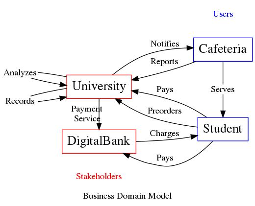

# Table of Contents

1.  [Introduction](#orga7b7e7c)
    1.  [Purpose](#orgb01b6ba)
    2.  [Assumptions](#orgaa9e313)
    3.  [Terminology](#orgb0da565)
2.  [Business Domain](#org3285f9f)
    1.  [Usage Scenarios](#org5459e08)
        1.  [Student Case](#orgbfbbe5a)
        2.  [Cafeteria Case](#org3fa786a)
    2.  [Participants](#org61a347b)
        1.  [Stakeholders](#orgdd5e761)
        2.  [Users](#org895c2e9)
    3.  [Model](#orgbca3104)
    4.  [Conceptual Services](#org21e41f9)
        -   [Preorder Service](#org44e399b):hybrid:
        -   [Prediction Service](#orgfbaa7a0):hybrid:
        -   [Menu Changing Service](#orge963056):task:
        -   [View Service](#org6ce5918):entity:
3.  [Functional Requirements](#org931c871)
    -   [*Requirements*](#orgcd185f0)
        -   [\* FR-01 : *Placing Orders*](#orgd815ef3)
        -   [FR-02 : *Schedule Pickup*](#org552d7ec)
        -   [FR-03 : *Electronic Payment*](#org813d9d8)
        -   [\* FR-04 : *Record Transactions*](#org2020c3e)
        -   [FR-05 : *Send Transactions Records*](#org2ed151e)
        -   [FR-06 : *Send Cafeteria Orders*](#orgc8a9062)
        -   [FR-07 : *Authorization*](#orge26bf21)
        -   [\* FR-08 : *Trend Analysis*](#org5362e1b)
4.  [Quality Requirements](#org93aa744)
    1.  [QR-01 : *Security*](#org68c62f6)
    2.  [QR-02 : *Availability*](#org5c889ec)
    3.  [QR-03 : *Usability*](#org11e73f8)
5.  [Business Services](#org8654a2a)
    1.  [BS-01 : *Transaction Recording*](#org6238ac0)
        1.  [Involved Participants](#org521fad0)
        2.  [Detailed Operational Description](#orga0aa5f5)
        3.  [Service Behavior](#org5adaa87)
        4.  [Service Decomposition](#org3c835a7)
    2.  [BS-02 : *Statistical Analysis*](#org312c653)
        1.  [Involved Participants](#orgf9404c5)
        2.  [Detailed Operational Description](#org34d4c7a)
        3.  [Service Behavior](#org20d6b94)
        4.  [Service Candidates Decomposition](#orgea33b3b)
    3.  [BS-03 : *Preordering*](#org9ce0405)
        1.  [Involved Participants](#org93c6192)
        2.  [Detailed Operational Description](#org3e00f67)
        3.  [Service Behavior](#org1010043)
        4.  [Service Decomposition](#org9edf891)
6.  [Design Space](#org1f9d85b)
    -   [AK-SPAM 1](#org6fefd4c)
        -   [Concern](#orge6c9537)
        -   [Criteria](#org25b3dc1)
        -   [Options](#org3660397)
        -   [QOC Diagram](#org1110e47)
7.  [Sustainability Strategies](#orgb1c564d)
    1.  [SS-01 : Custom Pre-order Bento Boxes](#org2a01c9d)
        1.  [Diagram](#orgd861509)
        2.  [QOC Mapping](#orge038fd0)

# TODO Introduction

## Purpose

This document presents a design aimed at reducing waste, caused by
a university cafeteria over-producing food, by using a pre-ordering
service along with historical analysis to provide accurate
short-term demand estimates as well as insight into overall trends.

## TODO Assumptions

## TODO Terminology

# DONE Business Domain

## DONE Usage Scenarios

### Student Case

Frank and Giorgia are sitting in class taking notes on their
laptops. They want to eat at the Cafeteria before their next
lecture. The University Cafeteria has a wide variety of food
available, and Frank is hungry so he looks up the Cafeteria's menu
and decides to get fish and chips with a side of salad. Giorgia
does the same, but also places an order and schedules to pick it
up in thirty minutes.

Frank and Giorgia leave class and go the Cafeteria. When they
arrive Frank looks around for his desired meal, but does not see
it. Another batch of fish and chips is being made and he'll have
to wait or choose something else. 

Giorgia instead goes to a kiosk labeled "Pick-up" and tells the
clerk her name and order number. The clerk fetches her meal, and
she goes to pay the cashier.

### Cafeteria Case

At the beginning of a new day cooks in the Cafeteria begin
preparing that day's meals. This is the core menu.

They also prepare some meals that have already been ordered for
the morning. Which are placed in temporary storage, organized for
quick retrieval and preserved to keep the hot and cold items
fresh. Students come and go picking up their orders, or taking
time choosing a meal. Some 

The kitchen notices that a particular item is selling less than
usual and by the end of the day there looks to be an excess amount
of waste. The kitchen signals to the computer system that it
should promote this item in some way. Either through a banner in
the app, placing the item nearer to the top of the menu, putting
on a token sale of the item, or whatever other promotional
method.

At the end of the month the kitchen notices that some items were
unpopular based off of the sales statistics. The kitchen then
decides that they will take those items off the menu, or make less
for the next month.

## DONE Participants

### Stakeholders

1.  **University**

    The University is a service provider and will provide a
    preordering service for students and a notification service for
    the Cafeteria, informing it of students' orders. As a part of the
    preorder service, the University will also consume the services
    of a Digital Bank.
    
    Additionally the University will be recording transactions made
    through the preorder service (and those made without it) so that
    the data may later be analyzed.

2.  **Digital Bank**

    A Digital Bank provides a digital payment service, processing
    pre-order payments made Students that intend to pay at the time
    of pre-ordering.

### Users

1.  **Cafeteria**

    The Cafeteria serves food to Students, receiving orders directly
    from a student or indirectly via the University's
    preorder/notification service. The Cafeteria will also report
    sales and unsold product. The Cafeteria produces the supply.

2.  **Students**

    A Student of the University is a customer of the
    Cafeteria. Students are the entities which generate demand.

## Model

## Conceptual Services

This section contains a list of every service that could be related
to the operation of the proposed system. In it are both software
and non-software services, we will describe the details of some of
the former and assume the latter will be provided by other
entities.

### Preorder Service     :hybrid:

The service by which Students can communicate their demand ahead
of time.

-   **Authorization Service**     :utility:

    Provided by the University for the Students, Cafeteria, and
    University Administrators. Serves as a secure gateway for
    accessing software components of the system.
    
    -   Registration Service     :utility:
    
    -   Login Service     :utility:

-   **Online Ordering Service**     :hybrid:

    Provided by the University for the Students. An internet gateway
    Students use to interact with the system.
    
    -   (Menu) Viewing Service     :entity:
    
    -   Shopping Cart Service     :entity:
    
    -   Scheduling Service     :task:

-   **Notification Service**     :task:

    Provided by the University to the Cafeteria. Informs the
    Cafeteria of what orders have been placed, the contents of the
    order and the desired pickup time.

-   **Digital Payment Service**     :utility:

    Provided by the Digital Bank stakeholder, if the Student wishes
    to pay at the time of preordering, they are transferred to the
    Digital Bank's service in order to complete the payment.

-   **Food Service**     :task:

    Non-software service provided the Cafeteria, performing manual
    labor required to complete orders.
    
    -   Food Preparation Service     :task:
    
        Fulfillment of Student orders.
    
    -   Order Validation Service     :task:
    
        Matching of a Student to their order at pickup.
    
    -   Food Fetching Service     :task:
    
        Retrieval of a Student's order at pickup.

### Prediction Service     :hybrid:

The service by which a prediction of demand in the short and long
term is made.

-   **Analysis Service**     :entity:

    Owned by the University. Analyzes collected data in order to
    develop a model for future demand.

-   **Monitor Service**     :task:

    Owned by the University. Records orders made through the preorder
    service or collects data regarding the other sales made at the
    Cafeteria.
    
    -   Reporting Service     :utility:
    
        Provided for the Cafeteria by the University. The Cafeteria
        reports sales made, preorders fulfilled, and excess production.

-   **Data Storage Service**     :task:

    The data the University collects on orders needs to be stored
    somewhere, whether this is done on an owned asset or if though a
    service provided by another stakeholder.

-   **(Data) Viewing Service**     :entity:

    The data which has been stored must be accessible for the
    University to perform analysis.

### Menu Changing Service     :task:

The Cafeteria has to be able to change the menu from week to week,
or over whatever time period the menu changes.

### View Service     :entity:

# Functional Requirements

In this section we list some of the functional requirements that our
services, as they are described, must fulfill. They have been
derived from the services outlined in the [Conceptual Services](#org21e41f9)
section. The format is:

-   **ID : *Name***
    
    Short Description

For our purposes we will select functional requirements most
relevant to the problem of accurately predicting demand. To this end
we will be concerned with FR-01 (*Placing Orders*), FR-04 (*Record
Transactions*), and FR-08 (*Trend Analysis*). These three functions
form a skeleton of the proposed service: when a Student places an
order, that data is collected by the University and saved for future
analysis. This means we will neglecting the Digital Bank
stakeholder, and perhaps only touching the actions of the
Cafeteria. The other functionalities listed are necessary but
peripheral to the core intent of this proposal.

## *Requirements*

### \* <a id="orge1e5335">FR-01</a> : *Placing Orders*

A Student must be able to place an order without being physically
present at the Cafeteria

### <a id="orgf857cac">FR-02</a> : *Schedule Pickup*

As an order is placed, the Student should also be able to specify
a time they wish to obtain their order.

### <a id="orgae7c30a">FR-03</a> : *Electronic Payment*

A Student should be able to optionally pay at the time of placing
their order.

### \* <a id="org8563b89">FR-04</a> : *Record Transactions*

Each transaction made must be recorded.

### <a id="org60ea5a8">FR-05</a> : *Send Transactions Records*

If a transaction is not made through the preorder system, the
Cafeteria must still report it to the University.

### <a id="orga8e9c1a">FR-06</a> : *Send Cafeteria Orders*

There must be a system in place so that the Cafeteria receives
preorders as soon as possible.

### <a id="org69df82a">FR-07</a> : *Authorization*

The system must be properly secured so that users of the system
may register, log in, and perform whatever actions that particular
user is permitted and no others.

### \* <a id="org97df018">FR-08</a> : *Trend Analysis*

The system must have some way of extrapolating demand based on the
number of preorders, correlated with historical data.

---

All this and more&#x2026;

# Quality Requirements

This section will discuss the most important qualities in
considering the problem of more accurately predicting and meeting
demand. For clarity we will use standard<a id="fnr.1" class="footref" href="#fn.1">1</a> definitions.

## <a id="org56230f0">QR-01</a> : *Security*

-   **Definition:** degree to which a product or system protects
    information and data so that persons or other
    products or systems have the degree of data access
    appropriate to their types and levels of
    authorization

We choose security because adoption of the system is predicated on
security. If the system is not secure and leaks important
information, or is otherwise compromised, trust in the system will
diminish to nothing. Any security faults regarding the online
payment process would be especially deleterious.

## <a id="org1b1b090">QR-02</a> : *Availability*

-   **Definition:** degree to which a system, product or component is
    operational and accessible when required for use

The system must be reliably available to users on campus and off,
with as little down-time as possible. The end users rely on the
preorder service to order food ahead of time, and the University
relies on it to develop a model for demand.

## <a id="org70ebe1a">QR-03</a> : *Usability*

-   **Definition:** degree to which a product or system can be used by
    specified users to achieve specified goals with
    effectiveness, efficiency and satisfaction in a
    specified context of use

The students will want to be able to use the services quickly and
easily, because they only need to browse through the menu and place
an order, regardless of the device. If the service is too complex
to use they will not make pre-ordering a habit which contradicts
our goal of changing Student behavior to thinking ahead about what
they should eat.

Users of the system on the side of the Cafeteria should also have
an easy time navigating it. A minimal requirement of knowledge
should be required to use it and a minimal number of actions
required to operate it.

# Business Services

## <a id="org31ab24f">BS-01</a> : *Transaction Recording*

### Involved Participants

<table border="2" cellspacing="0" cellpadding="6" rules="groups" frame="hsides">

<colgroup>
<col  class="org-left" />

<col  class="org-left" />
</colgroup>
<tbody>
<tr>
<td class="org-left">University</td>
<td class="org-left">Cafeteria</td>
</tr>
</tbody>
</table>

### TODO Detailed Operational Description

This service operates as a log for tracking the transaction
history of the system, recording both transactions made at the
Cafeteria and through the Preorder Service. The Transaction
Recording Service also manages the transactions for meals ordered
locally or pre-ordered, upon payment, and allows the staff to
retrieve and verify the transaction log. These records will also
be used by the "Statistical Analysis Service" to generate
statistics.

### Service Behavior

In this first activity diagram we will be more explicit about each
service involved, but we will abstract some (Authentication and
Response) away to simplify the other activity diagrams.

### Service Decomposition

## <a id="orga75220d">BS-02</a> : *Statistical Analysis*

### TODO Involved Participants

<table border="2" cellspacing="0" cellpadding="6" rules="groups" frame="hsides">

<colgroup>
<col  class="org-left" />
</colgroup>
<tbody>
<tr>
<td class="org-left">University</td>
</tr>
</tbody>
</table>

### TODO Detailed Operational Description

After successful login, the administrator can use the Statistics
Options. They can view statistical data during some timeline or
insert how much food waste in kg was measured for a specific time
period by the cafeteria staff. Whatever their choice, the request
is sent and handled by the Statistical Analysis Service.

The Service initially asks for login credentials. If the
credentials are valid, it identifies whether the user asks for
statistical data or wishes to store new information. If they want
to view an analysis, the relevant information is retrieved and
analyzed and view data is produced, that corresponds to the graphs
or other views that will display this analysis. On the other hand,
the information about the weight measurement is stored.

This Service does not deal with registering new administrators in
the system. This could be handled by another service, as it
requires information and actions irrelevant with the statistical
analysis.

### DONE Service Behavior

### DONE Service Candidates Decomposition

## <a id="orgafbff69">BS-03</a> : *Preordering*

### DONE Involved Participants

<table border="2" cellspacing="0" cellpadding="6" rules="groups" frame="hsides">

<colgroup>
<col  class="org-left" />

<col  class="org-left" />

<col  class="org-left" />
</colgroup>
<tbody>
<tr>
<td class="org-left">Students</td>
<td class="org-left">University</td>
<td class="org-left">Digital Bank</td>
</tr>
</tbody>
</table>

### TODO Detailed Operational Description

A Student may order food from the Cafeteria ahead of
arriving. This may be done through an web or a phone app which
serves as the Student's interface to the system. An authorized
user logs in, and is presented with the home screen, presenting
whatever new information about menu items or new deal that the
administrators want.

From the home screen the user can log out, view the menu, or view
their past orders. The user may repeat or edit an order from
their history, or fill out a new order from the menu. After
completing an order the user schedules a time to pick up their
order and receives a number to give the cashier. In finalizing the
order the Student may also choose to pay online or at the time of
pickup.

### DONE Service Behavior

### DONE Service Decomposition

# Design Space

## AK-SPAM 1

### Concern

-   **Con#1:** How can the user be encouraged to use the pre-ordering
    system? Are there any barriers or concerns that the
    customer or business would have that would make them
    not want to use it, undercutting the primary goal of
    reducing waste via this system?

### Criteria

-   **Cr#1:** Security
-   **Cr#2:** Availability
-   **Cr#3:** Usability

### Options

-   Trusted Third Party Payment

    -   **ID:** Con#1-Opt#1
    -   **Description:** Pre-order payment should be done through a
        trusted and known third party with experience so
        the process is secure.
    -   **Status:** Decided
    -   **Relationship(s):** none
    -   **Evaluation:** &#x2014;
        -   Cr#1 &#x2014; This option is secure as long as the third party
            maintains integrity. While we have a less control over the
            security of the system, a third-party payment processing
            company's business is predicated on security, so we assess
            this positively.
        -   Cr#2 &#x2014; This option's availability depends again on the
            third party, it is partially out of our control, depending on
            the service model of the third party.
        -   Cr#3 &#x2014; This option should have positive usability,
            especially if it is through an already common service that
            Students already use.
    -   **Rationale:** Given that the third-party processing company is
        of repute, this option should have the best
        security, availability, and usability. The same
        functionality is achieved as implementing it
        in-house but with a slight recurring cost.

-   Payment on Pickup

    -   **ID:** Con#1-Opt#2
    -   **Description:** There is no online payment system, the customer
        pays for items upon receipt.
    -   **Status:** Rejected
    -   **Relationship(s):** none
    -   **Evaluation:** &#x2014;
        -   Cr#1 &#x2014; This option is as secure as the Cafeteria itself. No
            additional attack vectors are added to the existing
            infrastructure.
        -   Cr#2 &#x2014; The rest of the system may still have high
            availability, but payment is only available when at the
            Cafeteria, so this option has a negative effect on
            availability.
        -   Cr#3 &#x2014; This option does nothing to improve usability,
            it does not enable Students to complete payment more than
            without the system so we assess this as negative in the
            usability dimension.
    -   **Rationale:** No significant functionality is added, nor are the
        qualities we listed improved by Payment on Pickup,
        so we reject this option

-   In-house Payment System

    -   **ID:** Con#1-Opt#3
    -   **Description:** Online payment is done via a system we've
        implemented
    -   **Status:** Rejected
    -   **Relationship(s):** none
    -   **Evaluation:** &#x2014;
        -   Cr#1 &#x2014; This option has implications for
            security. Implementing a payment handling
            system creates a dangerous potential attack
            vector and lost trust is hard to regain.
        -   Cr#2 &#x2014; This option could be more or less reliable than
            Con#1-Opt#1 depending on the quality and architecture of the
            implementation.
        -   Cr#3 &#x2014; This option could be integrated into our solutions
            even more than Con#1-Opt#1 because of its in-house nature and
            provide a better user experience.
    -   **Rationale:** The option is strongly depends on the quality of
        the developed in-house system and its superiority
        in terms of cost and effectiveness.

### QOC Diagram

# TODO Sustainability Strategies

## TODO <a id="orgee40d84">SS-01</a> : Custom Pre-order Bento Boxes

-   **Description:** Customizable lunch boxes which Students order
    ahead will give insight on customer buying
    patterns, and encourage them to take more
    appropriate serving sizes, and enable the return
    of uneaten food stuff.
-   **Type of Strategy:** People Awareness
-   **Relevance for Business Domain:** Offering stakeholders insight on
    customer buying patterns and minimizing food wastage is the
    primary aim of this system. The use of pre-packed bento boxes
    and provision for pre-orders and refunds directly helps in
    achieving this objective by spreading awareness of food
    wastage and offering incentives to follow sustainable
    practices.

### TODO Diagram

### TODO QOC Mapping

# Footnotes

<a id="fn.1" href="#fnr.1">1</a> ISO/IEC 25010:2011
